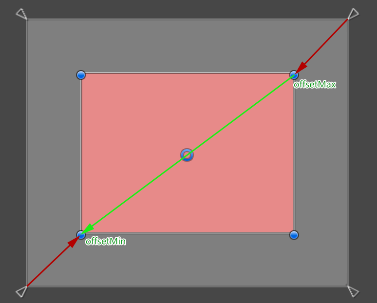

# [Anchors锚点](https://docs.unity3d.com/cn/2019.4/Manual/UIBasicLayout.html)

### 简介：

RectTransform（下简称RectT）包含一种称为**锚点**的布局概念。锚点在 Scene 视图中显示为四个小三角形控制柄，锚点信息也显示在 Inspector 中。

如果物体的的父项也是RectT，则子RectT还可通过各种方式锚定到父RectT。例如，子项可以锚定到父项的中心，或锚定到一个角。

锚点有几种形态：一个点，一条线，一个矩形，这三种形态

#### 锚点为一个点时候：

> - 在数值上表示为：achorMin.x==achorMax.x && achorMin.y==achorMax.y
> - Width/Height可以设置，不受Anchors影响。（代表物体的宽和高）
> - PosX/PosY可以设置。设置此值后，矩形轴心点与锚点之间的距离就恒定了，不管如何改变父UI的尺寸。（代表物体的中心对锚点的偏移量）
> - 子UI不会随父UI进行拉伸，位置和大小是固定的。（指的不是scale的拉伸，是Width和Height）

anchorMax.y=当前RectT上方的边和父RectT上方的边的距离

anchorMax.x=当前RectT右方的边和父RectT右方的边的距离

锚点为中心时（min和max全部为0.5），这时调整offsetMax和offsetMin，两者的数值会叠加，也就是操作Min和Max没有区别

#### 锚点为一条线时：

- 一条横线：achorMin.y==achorMax.y。子UI宽度会随父UI进行拉伸，高度和Y方向的距离是固定的。此时，Left,Right,PosY,Height可以设置。
- 一条竖线：achorMin.x==achorMax.x。子UI高度会随父UI进行拉伸，宽度和X方向的距离是固定的。此时，Top,Bottom,PosX,Width可以设置。
- Left是指物体RectT左边的边和父RectT左边的距离。offsetMin和Max这时也是叠加态，操纵offset的值会叠加计算，offsetY的值就是PosY的值，X的值就是以锚线的中心点的左右偏移量。sizeDelta的X是修改物体的宽度，Y是高度。 anchorPosition和Position操作均无效。

如果要动态指定一个锚点布局，首先计算锚点的矩形的位置，然后把sizeDelta，offset全部指定为0，这样的效果是同比例下物体大小=锚点矩形，会根据父RectT的动态伸缩。

#### 锚点为一个矩形时:

- achorMin.y!=achorMax.y && achorMin.y!=achorMax.y（min和Max均不相等）
- 子UI宽高都是拉伸状态。（相对父物体）。
- Left, Top, Right, Bottom可设置，矩形的四条边与锚框的边间距是固定的。（anchorPosition和Position设置无效。pivot在最下方时 offsetMaxY设置无效，最左边时X设置无效 为何？）

anchorPostision在锚框形态下是通过一个算法计算的，暂时理解以锚框的边缘点到RectT四个点的延长线点为坐标系（这个坐标系是第四象限坐标系，原因未知，也可能是我理解有问题），RectT的Poivot在这个坐标系上的位置。

#### SizeDelta:

izeDelta是锚点定义的子矩形与锚点区域大小偏移量，也可以称之为尺寸变化量。

如图所示，红色区域为锚点定义的子矩形，矩形相对锚点的偏移就可以通过右上角与锚点右上角的offsetMax到左下角与锚点左下角的offsetMin之间的向量（绿色箭头）来表示。

因此得出锚框下的计算方法：$sizeDelta=offSetMax-offSetMin$  ,锚点下代表物体的长高

