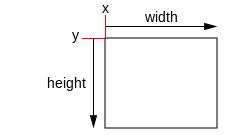
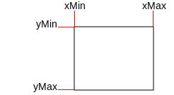
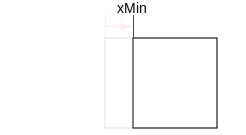

表示一个矩形，由X，Y，width，height定义。

由 X 和 Y 位置、宽度以及高度定义的 2D 矩形。

Unity 使用了一些 2D 坐标空间，其中大部分将 X 定义为向右增加，而 Y 向上增加。 一个例外是 GUI 和 GUILayout 类，其中 Y 向下增加。

以下示例在 GUI 空间中进行展示，其中 (0,0) 表示左上角，而 Y 向下增加。

矩形可以采用两种不同方式进行指定。第一种是使用 [x](https://docs.unity3d.com/cn/2019.4/ScriptReference/Rect-x.html) 和 [y](https://docs.unity3d.com/cn/2019.4/ScriptReference/Rect-y.html) 位置以及 [width](https://docs.unity3d.com/cn/2019.4/ScriptReference/Rect-width.html) 和 [height](https://docs.unity3d.com/cn/2019.4/ScriptReference/Rect-height.html)：

另一种方式是使用其每个边缘的 X 和 Y 坐标。这些坐标称为 [xMin](https://docs.unity3d.com/cn/2019.4/ScriptReference/Rect-xMin.html)、[xMax](https://docs.unity3d.com/cn/2019.4/ScriptReference/Rect-xMax.html)、[yMin](https://docs.unity3d.com/cn/2019.4/ScriptReference/Rect-yMin.html) 和 [yMax](https://docs.unity3d.com/cn/2019.4/ScriptReference/Rect-yMax.html)：

请注意，虽然 `x` 和 `y` 的值与 `xMin` 和 `yMin` 相同，但是它们在进行设置时具有不同的行为方式。设置 `x` 或 `y` 会改变矩形的位置，而大小不变：

设置 `yMin`、`yMin`、`yMin` 和 `yMax` 中的任何值会调整矩形大小，但是相对边缘的位置保持不变：

