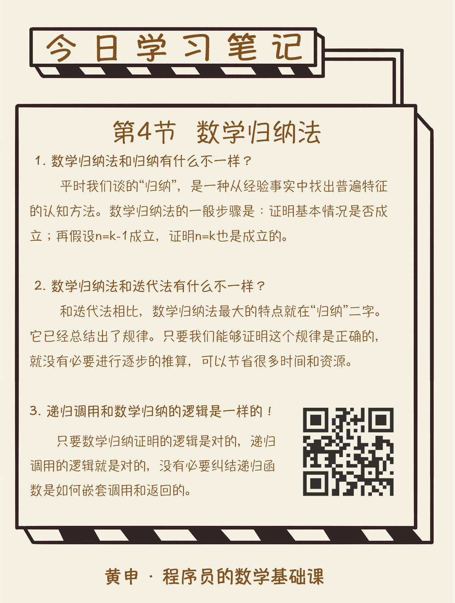
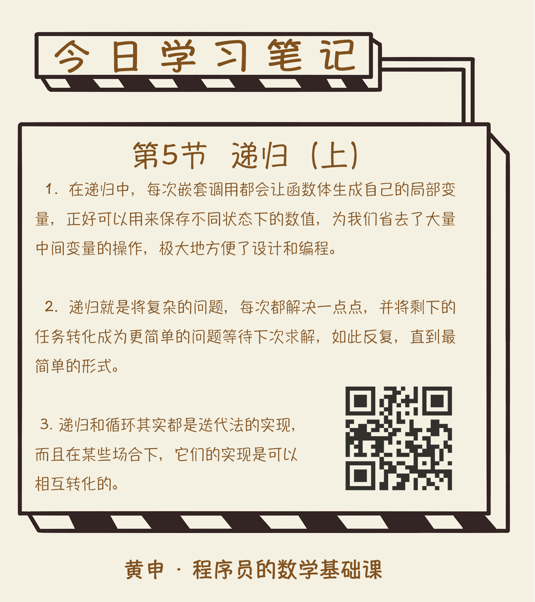

# 数学归纳法(从归纳法理解递归)

数学归纳法的一般步骤是这样的：

**证明基本情况（通常是 n=1 的时候）是否成立；**

**假设 n=k−1 成立，再证明 n=k 也是成立的（k 为任意大于 1 的自然数）。**

和使用迭代法的计算相比，数学归纳法最大的特点就在于“归纳”二字。它已经总结出了规律。只要我们能够证明这个规律是正确的，就没有必要进行逐步的推算，可以节省很多时间和资源。

递归把计算交给计算机，归纳把计算交给人，前者是拿计算机的计算成本换人的时间，后者是拿人的时间换计算机的计算成本

